## 1. Visión del Proyecto
**KinalApp** Lo que realizamos fue una API REST construida con tecnologías modernas del ecosistema Java. Su función principal es administrar el ciclo de ventas de un negocio, facilitando la ejecución de operaciones CRUD (Crear, Leer, Actualizar y Eliminar) sobre entidades fundamentales como clientes, productos, usuarios y las transacciones de venta.

La aplicación destaca por su **integridad referencial**, asegurando que cada venta esté vinculada a un cliente existente y sea procesada por un usuario autorizado en el sistema.

---

## 2. Especificaciones Técnicas
* **Lenguaje**: Java 21 (LTS).
* **Framework**: Spring Boot 4.0.2.
* **Persistencia**: Spring Data JPA con motor **MySQL**.
* **Gestión de Dependencias**: Maven (POM XML).
* **Estandarización de Datos**: Implementación de tipos **Long** en todos los identificadores (ID).

---

### Requisitos de Entorno
* **Java Development Kit (JDK) 21**.
* **Servidor MySQL** (Puerto 3306).
* **Maven 3.9+**.

### Pasos de Instalación
* ** 1. Clonar repositorio: `https://github.com/eruano-2025017/Taller2.git`
* ** 2. Abrir Intellij IDEA.
* **3. Abrir la carpeta que clonó.
* ** 4. Abrir MySQL en su ordenador.
* ** 5. Ingresar a la instancia activa en MySQL.
* ** 6. Regresar a Intellij IDEA.
* ** 7. Dirigirse a la carpeta `src\main\java\com\estebanruano`.
* ** 8. Dirigirse a `KinalAppApplication` y ejecutar la aplicación.
* ** 9. Abrir la carpeta `resources/application.properties`.
* ** 10. Verificar qué puerto está utilizando la aplicación.
* ** 11. Abrir el navegador y poner el puerto: `http://localhost:8083/vista/` (Frontend) o `http://localhost:8083/clientes` (API).

---
## 4. Diccionario de Endpoints (API Reference)

El sistema utiliza rutas normalizadas para cada recurso, diferenciando las operaciones mediante verbos HTTP (GET, POST, PUT, DELETE).

###  Módulo de Clientes (`/clientes`)
* `GET /clientes`: Lista todos los clientes registrados.
* `POST /clientes`: Registra un nuevo cliente.
* `GET /clientes/estado`: Filtra clientes con estado activo.
* `GET /clientes/{id}`: Busca un cliente por su ID (**Long**).
* `PUT /clientes/{id}`: Actualiza los datos de un cliente.
* `DELETE /clientes/{id}`: Baja lógica o física de un cliente.

###  Módulo de Usuarios (`/usuarios`)
* `GET /usuarios`: Lista todos los usuarios registrados.
* `POST /usuarios`: Registra un nuevo usuarios.
* `GET /usuarios/estado`: Filtra usuarios con estado activo.
* `GET /usuarios/{codigoUsu}`: Busca un usuarios por su ID (**Long**).
* `PUT /usuarios/{codigoUsu}`: Actualiza los datos de un usuarios.
* `DELETE /usuarios/{codigoUsu}`: Baja lógica o física de un usuarios.

###  Módulo de Productos (`/productos`)
* `GET /productos`: Lista todos los productos registrados.
* `POST /productos`: Registra un nuevo productos.
* `GET /productos/estado`: Filtra productos con estado activo.
* `GET /productos/{codigoPro}`: Busca un productos por su ID (**Long**).
* `PUT /productos/{codigoPro}`: Actualiza los datos de un productos.
* `DELETE /productos/{codigoPro}`: Baja lógica o física de un productos.

###  Módulo de Ventas (`/ventas`)
* `GET /ventas`: Lista todos los ventas registrados.
* `POST /ventas`: Registra un nuevo ventas.
* `GET /ventas/estado`: Filtra ventas con estado activo.
* `GET /ventas/{codigoVen}`: Busca un ventas por su ID (**Long**).
* `PUT /ventas/{codigoVen}`: Actualiza los datos de un ventas.

###  Módulo de Detalles (`/detalleVentas`)
* `GET /detalleVentas`: Lista todos los clientes registrados.
* `POST /detalleVentas`: Registra un nuevo cliente.
* `GET /detalleVentas/{codigoDeVe}`: Busca un detalleVentas por su ID (**Long**).
* `PUT /detalleVentas/{codigoDeVe}`: Actualiza los datos de un cliente.

## 5. Frontend - Vistas de Usuario (Thymeleaf)

El sistema cuenta con una interfaz gráfica moderna desarrollada con **Thymeleaf**, **Bootstrap 5** y **CSS personalizado**. Todas las vistas están accesibles bajo el prefijo `/vista/`.

### 5.1 Rutas del Frontend

| Módulo | Vista | Ruta |
|--------|-------|------|
| **Dashboard** | Página principal | `GET /vista/` |
| **Clientes** | Lista de clientes | `GET /vista/clientes` |
| | Formulario nuevo cliente | `GET /vista/clientes/nuevo` |
| | Editar cliente | `GET /vista/clientes/editar/{dpi}` |
| | Ver cliente | `GET /vista/clientes/ver/{dpi}` |
| | Guardar cliente | `POST /vista/clientes/guardar` |
| | Eliminar cliente | `GET /vista/clientes/eliminar/{dpi}` |
| **Productos** | Lista de productos | `GET /vista/productos` |
| | Formulario nuevo producto | `GET /vista/productos/nuevo` |
| | Editar producto | `GET /vista/productos/editar/{codigo}` |
| | Ver producto | `GET /vista/productos/ver/{codigo}` |
| | Guardar producto | `POST /vista/productos/guardar` |
| | Eliminar producto | `GET /vista/productos/eliminar/{codigo}` |
| **Usuarios** | Lista de usuarios | `GET /vista/usuarios` |
| | Formulario nuevo usuario | `GET /vista/usuarios/nuevo` |
| | Editar usuario | `GET /vista/usuarios/editar/{codigo}` |
| | Ver usuario | `GET /vista/usuarios/ver/{codigo}` |
| | Guardar usuario | `POST /vista/usuarios/guardar` |
| | Eliminar usuario | `GET /vista/usuarios/eliminar/{codigo}` |
| **Ventas** | Lista de ventas | `GET /vista/ventas` |
| | Formulario nueva venta | `GET /vista/ventas/nuevo` |
| | Editar venta | `GET /vista/ventas/editar/{codigo}` |
| | Ver detalle venta | `GET /vista/ventas/ver/{codigo}` |
| | Guardar venta | `POST /vista/ventas/guardar` |
| **Detalle Venta** | Lista de detalles | `GET /vista/detalleVentas` |
| | Agregar producto a venta | `GET /vista/detalleVentas/nuevo` |
| | Editar detalle | `GET /vista/detalleVentas/editar/{codigo}` |
| | Ver detalle | `GET /vista/detalleVentas/ver/{codigo}` |
| | Guardar detalle | `POST /vista/detalleVentas/guardar` |

### 5.3 Paleta de Colores del Logo

| Color | Código | Uso |
|-------|--------|-----|
| Azul marino oscuro | `#062540` | Navbar, Footer |
| Azul medio | `#1F5373` | Botones primary, headers |
| Turquesa claro | `#73D9CF` | Botones success, acentos |
| Beige/café claro | `#D9AF8B` | Advertencias |
| Blanco/gris claro | `#F2F2F2` | Fondos de cards |

---

### 6.1 Rutas de Autenticación

| Ruta  Método  Descripción 
---------------------------
 `/`  GET  Redirige automáticamente al login 

 `/vista/login`  GET  Muestra el formulario de inicio de sesión 

 `/vista/login`  POST  Procesa las credenciales del usuario 

 `/vista/register`  GET  Muestra el formulario de registro 

 `/vista/register`  POST  Crea un nuevo usuario en el sistema 

 `/vista/logout`  GET  Cierra la sesión del usuario 

### 6.2 Componentes Agregados

| Componente | Ubicación | Función |
|------------|-----------|---------|
| `AuthController.java` | `controller/` | Maneja login, register y logout |
| `UsuarioService.autenticar()` | `service/` | Valida credenciales en la base de datos |
| `UsuarioRepository.findByUsername()` | `repository/` | Busca usuario por nombre de usuario |

### 6.4 Flujo de Funcionamiento

1. El usuario entra a `http://localhost:8083/`
2. Se dirije a `/vista/login`
3. Ingresa su username y password
4. El sistema valida las credenciales en la base de datos
5. Si son correctas, inicia sesión y redirige al dashboard (`/vista/`)
6. Si son incorrectas, muestra un mensaje de error
7. El usuario puede cerrar sesión en `/vista/logout`

### 7 Capturas De La Aplicación

### 7.1 Login KinalAPP
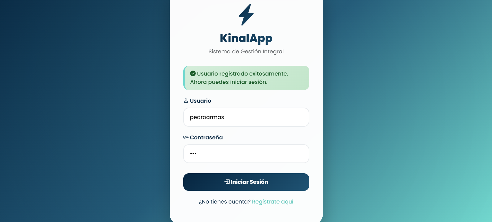

### 7.2 Registrar un Usuario
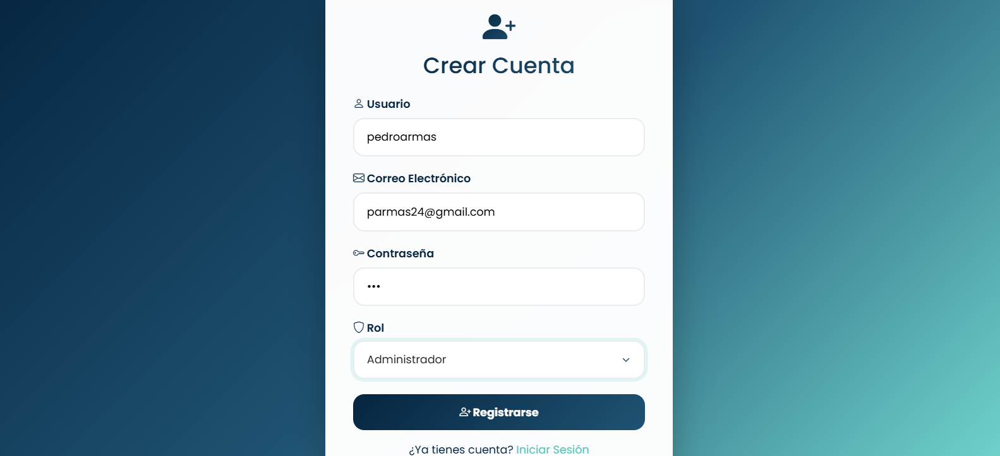

### 7.3 Iniciar Seccion KinalApp

### 7.4 Pagina Inicial KinalApp
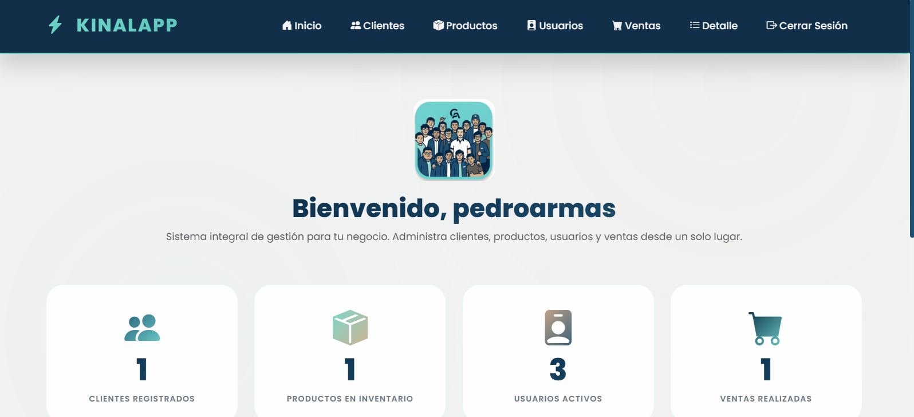

### 7.5 Creacion De Un Nuevo Cliente
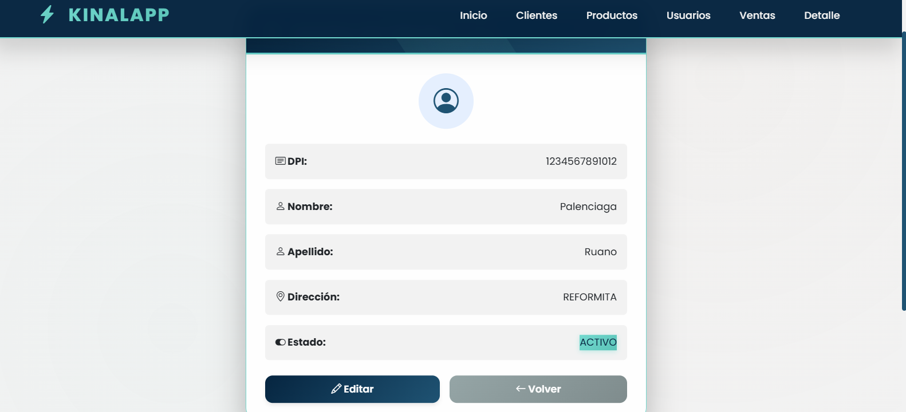

### 7.6 Creacion De Un Producto
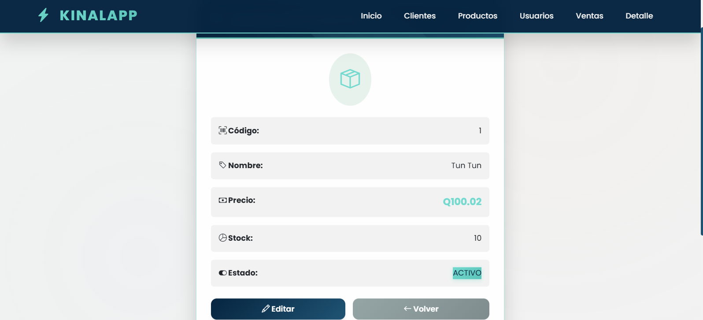

### 7.7 Vista de Usuarios
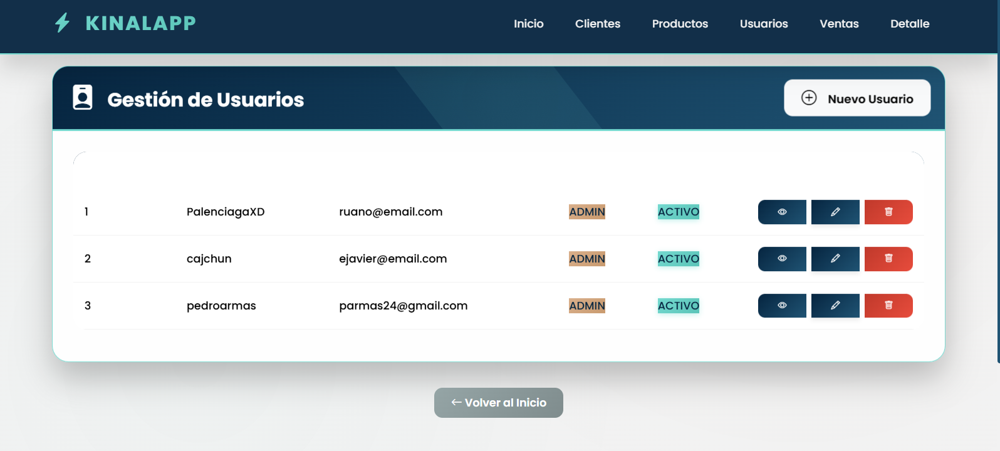

### 7.8 Vista De Una Venta
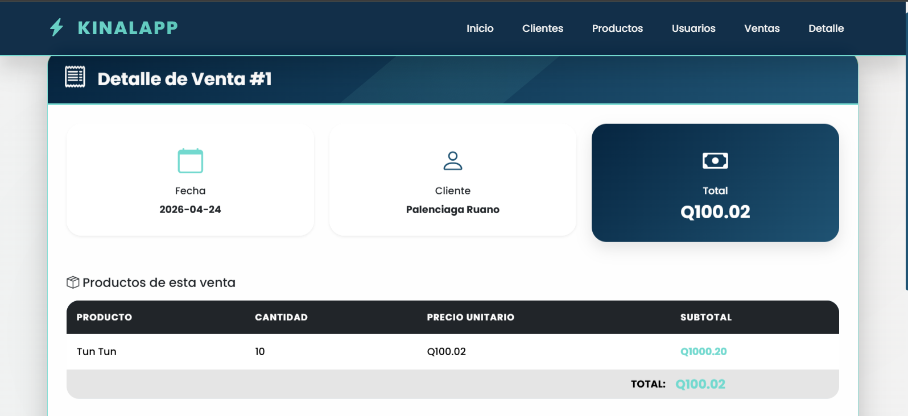

### 7.9 Vista de Detalle Venta
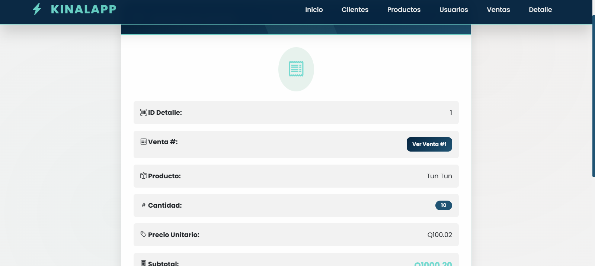

### 7.10 Lista De Creaciones
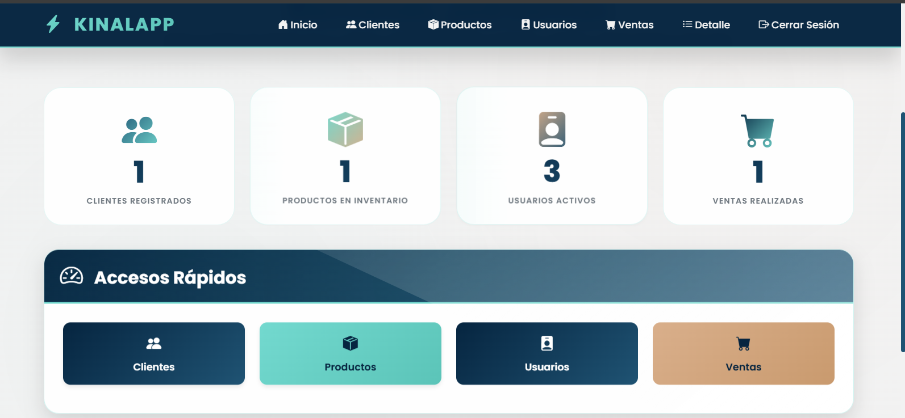

### 7.11 Base De Datos Conectado Al Frontend
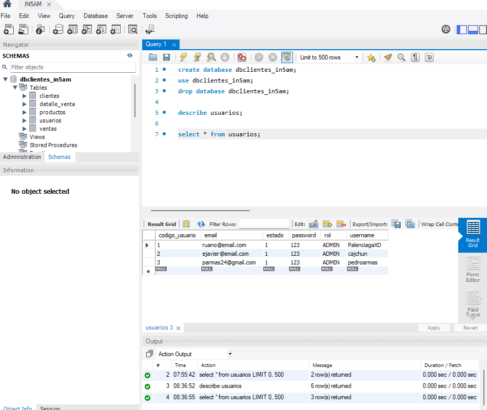

### 7.12 Diagrama Modelo Entidad Relacion
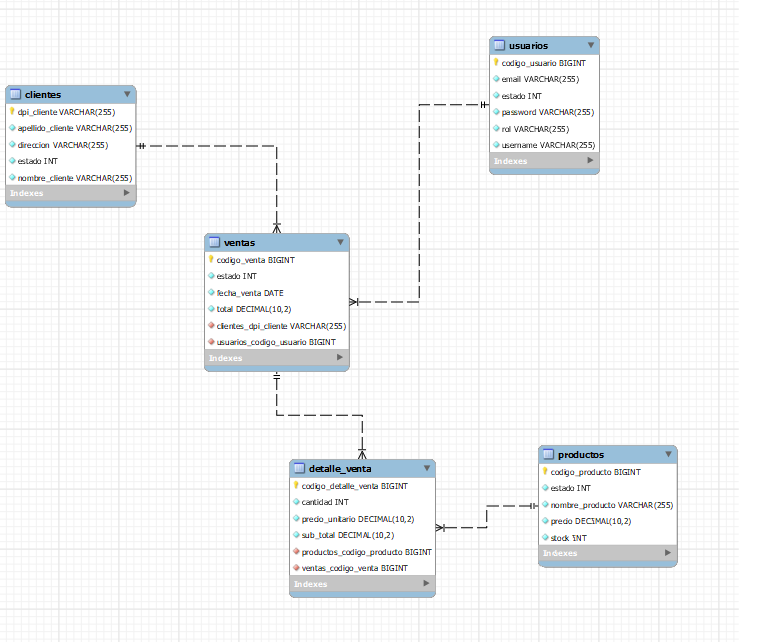